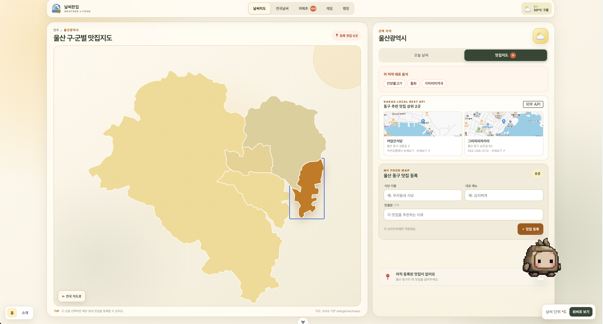
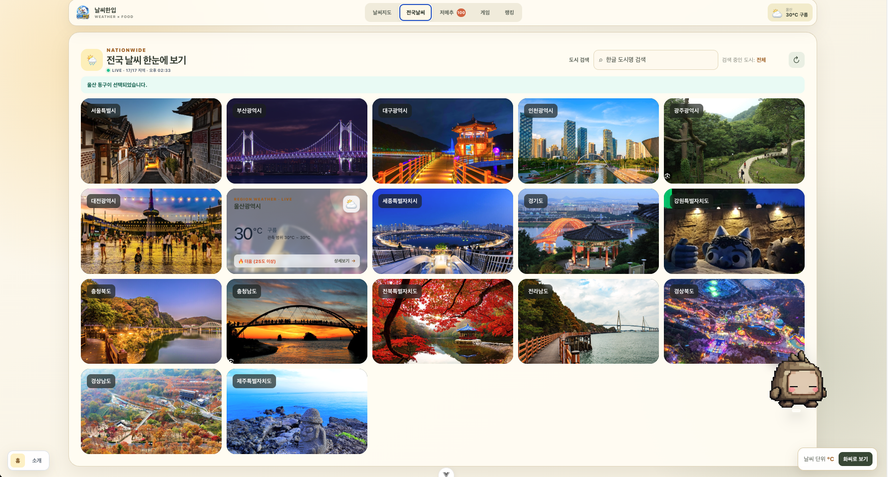
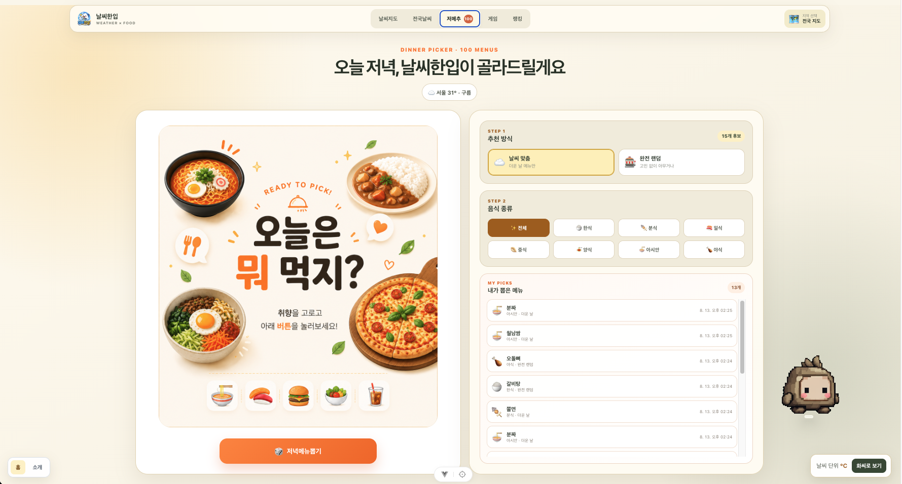
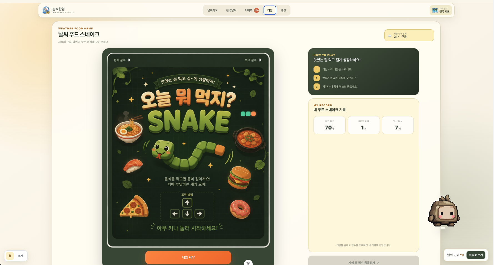
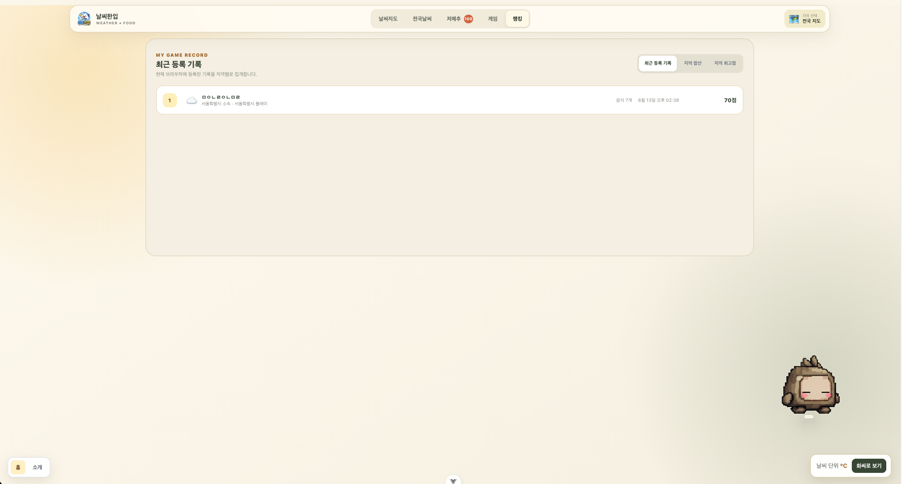

# 🌤️ 날씨한입

전국 17개 시·도의 현재 날씨를 지도와 카드로 확인하고, 날씨에 어울리는 음식까지 추천받는 Vue 기반 웹 서비스입니다.

날씨 정보가 중심이며, 시·도에서 구·군으로 이어지는 지도 탐색, 나만의 맛집 등록, 100가지 저녁 메뉴 추천, 날씨 푸드 스네이크 게임을 한 화면에서 제공합니다. OpenWeather 요청에 실패한 지역은 과제용 Mock 데이터를 유지해 화면을 안정적으로 표시합니다.


<table>
  <tr>
    <td align="center" width="50%">
      
      <br />
      <sub>울산 현재 날씨와 대표 음식</sub>
    </td>
    <td align="center" width="50%">
      
      <br />
      <sub>구·군별 맛집 지도와 맛집 등록</sub>
    </td>
  </tr>
  <tr>
    <td align="center" width="50%">
      
      <br />
      <sub>전국 17개 시·도 날씨 목록</sub>
    </td>
    <td align="center" width="50%">
      
      <br />
      <sub>날씨 기반 저녁 메뉴 추천</sub>
    </td>
  </tr>
  <tr>
    <td align="center" width="50%">
      
      <br />
      <sub>날씨 푸드 스네이크 게임</sub>
    </td>
    <td align="center" width="50%">
      
      <br />
      <sub>내 게임 기록과 지역 랭킹</sub>
    </td>
  </tr>
</table>

## 과제 평가 한눈에 보기

> 제출 과제는 **과제 1~5**입니다. 아래 링크에서 각 단계의 결과를 독립적으로 실행할 수 있으며, `/`는 과제 5까지 누적 적용한 최종 화면입니다.

| 구분      | 실행 URL                                        | 평가 핵심                                       | 대표 결과 파일                                                                                       |
| --------- | ----------------------------------------------- | ----------------------------------------------- | ---------------------------------------------------------------------------------------------------- |
| 과제 1    | [`/practice1`](http://localhost:3000/practice1) | Vue 디렉티브와 Mock 배열 렌더링                 | [`src/components/exercise/WeatherMockup.vue`](./src/components/exercise/WeatherMockup.vue)           |
| 과제 2    | [`/practice2`](http://localhost:3000/practice2) | Composition API 기반 검색·선택 상태 관리        | [`src/components/exercise/WeatherComposition.vue`](./src/components/exercise/WeatherComposition.vue) |
| 과제 3    | [`/practice3`](http://localhost:3000/practice3) | 컴포넌트 분리, props/emits, slot                | [`src/components/exercise/WeatherParent.vue`](./src/components/exercise/WeatherParent.vue)           |
| 과제 4    | [`/practice4`](http://localhost:3000/practice4) | Vue Router, View 분리, 동적 경로와 404 처리     | [`src/views/WeatherHomeView.vue`](./src/views/WeatherHomeView.vue)                                   |
| 과제 5    | [`/practice5`](http://localhost:3000/practice5) | Pinia state/getter/action과 섭씨·화씨 단위 전환 | [`src/views/PracticeFiveView.vue`](./src/views/PracticeFiveView.vue)                                 |
| 최종 화면 | [`/`](http://localhost:3000/)                   | 과제 1~5와 추가 기능을 통합한 서비스            | [`src/views/PracticeFiveView.vue`](./src/views/PracticeFiveView.vue)                                 |

개발 서버 실행 후 위 URL로 접속합니다. 평가용 경로는 최종 서비스의 화면 구성을 방해하지 않도록 상단 메뉴에는 노출하지 않고 Router에 직접 연결했습니다.

## 과제 1 — Vue 기본 문법과 Weather Mockup

- **실행 경로:** [`/practice1`](http://localhost:3000/practice1)
- **핵심 기능:** 세 도시의 Mock 날씨 데이터를 카드 목록으로 출력하고, 기온이 25℃ 이상인지에 따라 상태 문구를 구분합니다.
- **확인할 내용:** 배열 렌더링, 고유 key, 조건부 렌더링, 데이터 보간, 반응형 카드 레이아웃을 한 파일에서 확인할 수 있습니다.

| 해당 파일                                                                                  | 역할과 구현 근거                                                                                                                                                                                     |
| ------------------------------------------------------------------------------------------ | ---------------------------------------------------------------------------------------------------------------------------------------------------------------------------------------------------- |
| [`src/components/exercise/WeatherMockup.vue`](./src/components/exercise/WeatherMockup.vue) | `weatherList` Mock 배열을 정의하고 `v-for`와 `:key="item.id"`로 반복 렌더링합니다. `v-if`/`v-else`로 25℃ 이상은 `더움`, 미만은 `선선함`으로 표시하며 날씨 아이콘과 모바일 1열 레이아웃을 적용합니다. |
| [`src/router/index.js`](./src/router/index.js)                                             | `/practice1` 요청을 `WeatherMockup.vue`에 지연 로딩으로 연결합니다.                                                                                                                                  |

## 과제 2 — Composition API 기반 날씨 검색

- **실행 경로:** [`/practice2`](http://localhost:3000/practice2)
- **핵심 기능:** 도시 검색어와 선택 상태를 반응형으로 관리하고, 검색 조건에 맞는 날씨 카드만 실시간으로 표시합니다.
- **확인할 내용:** `ref`, `computed`, `watch`, `watchEffect`가 각각 어떤 상태와 동작을 담당하는지 확인할 수 있습니다.

| 해당 파일                                                                                            | 역할과 구현 근거                                                                                                                                                                                                                             |
| ---------------------------------------------------------------------------------------------------- | -------------------------------------------------------------------------------------------------------------------------------------------------------------------------------------------------------------------------------------------- |
| [`src/components/exercise/WeatherComposition.vue`](./src/components/exercise/WeatherComposition.vue) | `weatherList`, `searchQuery`, `selectedCityInfo`를 `ref`로 관리합니다. `computed`로 검색 목록을 만들고, `watch`로 선택 문구를 감시하며, `watchEffect`로 현재 검색어 변화를 추적합니다. 카드 선택 상태와 검색 결과 없음 UI도 함께 구현합니다. |
| [`src/router/index.js`](./src/router/index.js)                                                       | `/practice2` 요청을 `WeatherComposition.vue`에 지연 로딩으로 연결합니다.                                                                                                                                                                     |

## 과제 3 — 컴포넌트 분리와 부모·자식 통신

- **실행 경로:** [`/practice3`](http://localhost:3000/practice3)
- **핵심 기능:** 과제 2의 검색·선택 화면을 역할별 컴포넌트로 분리하고 부모가 상태와 비즈니스 로직을 소유하도록 구성했습니다.
- **확인할 내용:** props로 데이터를 내리고 emits로 이벤트를 올리는 흐름, 공통 slot 컨테이너, 컴포넌트별 scoped style을 확인할 수 있습니다.

| 해당 파일                                                                                          | 역할과 구현 근거                                                                                                                 |
| -------------------------------------------------------------------------------------------------- | -------------------------------------------------------------------------------------------------------------------------------- |
| [`src/components/exercise/WeatherParent.vue`](./src/components/exercise/WeatherParent.vue)         | 검색어, 필터 결과, 선택 상태와 이벤트 처리 함수를 소유하고 아래 자식 컴포넌트를 조립하는 과제 3 진입 화면입니다.                 |
| [`src/components/exercise/BaseDashboardCard.vue`](./src/components/exercise/BaseDashboardCard.vue) | 기본 slot으로 검색 영역과 날씨 목록을 감싸는 재사용 카드 레이아웃입니다.                                                         |
| [`src/components/exercise/SearchBar.vue`](./src/components/exercise/SearchBar.vue)                 | `currentQuery` prop을 받고 `update-query` emit으로 입력값을 부모에 전달합니다. Element Plus Input을 실제 검색 UI에 적용합니다.   |
| [`src/components/exercise/WeatherCard.vue`](./src/components/exercise/WeatherCard.vue)             | `cityItem` prop을 표시하고 `select-card`, `click-detail` 이벤트를 부모에 전달합니다. 과제 5의 온도 단위 표시에서도 재사용됩니다. |
| [`src/components/exercise/WeatherStatusBar.vue`](./src/components/exercise/WeatherStatusBar.vue)   | 부모가 전달한 선택 상태 문구를 Element Plus Alert로 표시하는 추가 분리 컴포넌트입니다.                                           |
| [`src/router/index.js`](./src/router/index.js)                                                     | `/practice3` 요청을 `WeatherParent.vue`에 지연 로딩으로 연결합니다.                                                              |

```text
WeatherParent.vue
├── BaseDashboardCard.vue
│   ├── SearchBar.vue       # currentQuery prop / update-query emit
│   └── WeatherCard.vue     # cityItem prop / select-card·click-detail emits
└── WeatherStatusBar.vue    # message prop으로 선택 상태 표시
```

## 과제 4 — Vue Router 기반 화면 구조

- **실행 경로:** [`/practice4`](http://localhost:3000/practice4)
- **추가 검증 경로:** [`/about`](http://localhost:3000/about), [`/weather/seoul`](http://localhost:3000/weather/seoul), 존재하지 않는 임의 주소
- **핵심 기능:** 앱을 View 단위로 분리하고 정적 경로, 동적 지역 상세 경로, 지연 로딩, Catch-all 404 처리를 실제 Router에 연결했습니다.
- **확인할 내용:** `/practice4`에서는 과제 3의 재사용 컴포넌트를 포함한 통합 화면이 기본 섭씨 단위로 실행됩니다.

| 해당 파일                                                              | 역할과 구현 근거                                                                                                                                    |
| ---------------------------------------------------------------------- | --------------------------------------------------------------------------------------------------------------------------------------------------- |
| [`src/main.js`](./src/main.js)                                         | 실제 앱 진입점에서 Router 인스턴스를 `.use(router)`로 전역 주입합니다.                                                                              |
| [`src/App.vue`](./src/App.vue)                                         | `<RouterView />`에 현재 View를 출력하고 `<RouterLink>`로 홈과 소개 화면을 이동합니다.                                                               |
| [`src/router/index.js`](./src/router/index.js)                         | `/`, `/practice1`~`/practice5`, `/about`, `/weather/:cityId`, Catch-all 경로를 정의하고 모든 라우트 컴포넌트를 함수형 `import()`로 지연 로딩합니다. |
| [`src/views/WeatherHomeView.vue`](./src/views/WeatherHomeView.vue)     | 과제 3의 `BaseDashboardCard`, `SearchBar`, `WeatherCard`를 재사용하는 과제 4 홈 화면이며 `/practice4`에 직접 연결됩니다.                            |
| [`src/views/WeatherAboutView.vue`](./src/views/WeatherAboutView.vue)   | `/about`에서 서비스와 Router 구조를 소개합니다.                                                                                                     |
| [`src/views/WeatherDetailView.vue`](./src/views/WeatherDetailView.vue) | `/weather/:cityId`의 동적 `cityId`로 지역 날씨와 5일 예보를 표시합니다.                                                                             |
| [`src/views/NotFoundView.vue`](./src/views/NotFoundView.vue)           | 등록되지 않은 모든 경로를 Catch-all로 받아 404 안내를 표시합니다.                                                                                   |

## 과제 5 — Pinia Store와 온도 단위 전환

- **실행 경로:** [`/practice5`](http://localhost:3000/practice5), 최종 화면 [`/`](http://localhost:3000/)
- **핵심 기능:** 전역 Store가 섭씨·화씨 상태를 관리하고 메인 날씨 카드와 지역 상세 화면의 모든 기온 표시를 같은 단위로 전환합니다.
- **확인할 내용:** Pinia 등록, state/getter/action, `storeToRefs`, Store를 사용하는 단위 전환 UI와 화면 반영 흐름을 확인할 수 있습니다.

| 해당 파일                                                                              | 역할과 구현 근거                                                                                                                      |
| -------------------------------------------------------------------------------------- | ------------------------------------------------------------------------------------------------------------------------------------- |
| [`src/main.js`](./src/main.js)                                                         | `createPinia()`를 생성해 Router와 함께 실제 Vue 앱에 전역 등록합니다.                                                                 |
| [`src/stores/configStore.js`](./src/stores/configStore.js)                             | `unit` state의 초기값을 `celsius`로 두고, `unitSymbol` getter와 `toggleUnit` action을 제공합니다.                                     |
| [`src/views/PracticeFiveView.vue`](./src/views/PracticeFiveView.vue)                   | `storeToRefs`로 `unit`과 `unitSymbol`을 반응형으로 꺼내 `WeatherHomeView`에 전달하고 `UnitToggler`를 배치하는 과제 5 진입 화면입니다. |
| [`src/components/exercise/UnitToggler.vue`](./src/components/exercise/UnitToggler.vue) | 현재 단위 기호를 표시하고 버튼 클릭 시 Store의 `toggleUnit` action을 실행합니다.                                                      |
| [`src/views/WeatherHomeView.vue`](./src/views/WeatherHomeView.vue)                     | 전달받은 단위에 따라 현재·최고·최저 기온을 변환하고 전국 날씨 카드에 동일한 단위 정보를 전달합니다.                                   |
| [`src/components/exercise/WeatherCard.vue`](./src/components/exercise/WeatherCard.vue) | `unit`과 `unitSymbol` props를 받아 카드의 섭씨 값을 화씨로 변환해 표시합니다.                                                         |
| [`src/views/WeatherDetailView.vue`](./src/views/WeatherDetailView.vue)                 | Pinia Store를 직접 사용해 지역 상세 기온과 5일 예보에도 동일한 단위를 적용합니다.                                                     |

## 실행 및 저장소 주소

- GitHub: [wldn-di/skala-vue](https://github.com/wldn-di/skala-vue)
- 로컬 완성형 화면: [http://localhost:3000/](http://localhost:3000/)
- 배포 주소: https://skala-vue-jiwoo.vercel.app/

## 주요 기능

- 전국 17개 시·도의 현재 날씨를 지도와 카드로 표시
- OpenWeather 실시간 관측값과 지역별 Mock 데이터 폴백
- OpenWeather 5일 예보 API를 이용한 지역 상세 예보
- Kakao Local REST API를 이용한 선택 구·군 추천 맛집 상위 2곳과 정적 지도 미리보기
- 일부 지역 요청만 실패해도 성공한 지역부터 갱신하는 부분 성공 처리
- 시·도에서 구·군으로 이어지는 SVG 지도 드릴다운
- 구·군별 나만의 맛집 등록과 삭제
- 도시명 검색과 검색 결과 없음 UI
- 날씨·기온·음식 카테고리를 조합한 100가지 저녁 메뉴 추천
- 현재 날씨에 따라 미션 음식이 달라지는 스네이크 게임
- 게임 결과 등록, 개인 기록, 지역 합산·최고점 랭킹
- Pinia 기반 섭씨·화씨 단위 전환
- 동적 상세 경로와 Catch-all 404 페이지
- 데스크톱과 모바일에 대응하는 반응형 레이아웃

## 기술 스택

| 구분                | 사용 기술                    |
| ------------------- | ---------------------------- |
| Frontend            | Vue 3, Composition API, Vite |
| State               | Pinia                        |
| Router              | Vue Router                   |
| HTTP                | Axios, Fetch API(Server)     |
| UI                  | Element Plus, CSS, SVG Map   |
| Weather             | OpenWeather API              |
| Serverless / Deploy | Vercel Functions, Vercel     |
| Quality             | ESLint, Oxlint, Prettier     |

## 화면 구성

| 경로 또는 메뉴              | 역할                                                      |
| --------------------------- | --------------------------------------------------------- |
| `/` · 날씨지도              | 전국 지도에서 시·도를 선택하고 날씨와 구·군별 맛집을 확인 |
| `/` · 전국날씨              | 17개 시·도 날씨 카드 검색 및 상세 화면 이동               |
| `/` · 저메추                | 날씨 맞춤 또는 완전 랜덤 방식으로 저녁 메뉴 추천          |
| `/` · 게임                  | 푸드 스네이크 플레이, 내 기록 요약 및 점수 등록           |
| `/` · 랭킹                  | 최근 등록 기록, 지역 합산 점수 및 지역별 최고점 조회      |
| `/weather/:cityId`          | 선택한 지역의 기온·날씨 지표 상세                         |
| `/about`                    | 서비스와 과제 구성 소개                                   |
| `/practice1` ~ `/practice5` | 과제 1~5 결과를 단계별로 독립 검증                        |
| `/:pathMatch(.*)*`          | 존재하지 않는 주소의 404 안내                             |

라우트 컴포넌트는 함수형 `import()`로 지연 로딩합니다. 완성형 화면 안의 날씨지도·전국날씨·저메추·게임·점수 화면은 `activeView` 상태로 전환합니다.

## 데이터 흐름

### 날씨

1. 완성형 화면이 마운트되면 브라우저가 Axios로 `/api/weather`를 요청합니다.
2. 로컬에서는 Vite 플러그인, 배포 환경에서는 Vercel Function이 요청을 처리합니다.
3. 서버는 허용된 전국 17개 시·도 좌표만 OpenWeather에 요청하며, `Promise.allSettled()`로 지역별 성공과 실패를 분리합니다.
4. 응답에서 기온·체감 온도·습도·풍속·강수량과 날씨 코드를 화면용 데이터로 정규화합니다.
5. 브라우저는 성공한 지역만 실시간 값으로 병합하고 실패한 지역은 기존 Mock 데이터를 유지합니다.
6. 새로고침 버튼으로 다시 동기화할 수 있으며, 화면을 떠날 때 진행 중인 요청을 취소합니다.

### 예보와 외부 맛집

1. 지역 상세 화면은 Axios로 `/api/forecast?regionId=...`를 호출합니다.
2. Vercel Function은 허용된 지역 좌표만 OpenWeather 5 day / 3 hour forecast API에 전달하고 일별 예보로 정규화합니다.
3. 구·군을 선택하면 Axios로 `/api/restaurants?regionId=...&district=...`를 호출합니다.
4. Vercel Function은 지역과 구·군을 검증한 뒤 Kakao Local 키워드 검색 API에서 음식점 상위 2곳을 가져옵니다.
5. 각 추천 카드의 위치는 REST 키를 숨긴 `/api/place-preview`가 Kakao 정적 지도 이미지로 제공합니다.
6. 외부 API가 실패해도 현재 날씨, Mock 폴백, 사용자가 직접 등록한 맛집은 그대로 사용할 수 있습니다.

### 지도와 맛집

1. 전국 SVG 지도에서 시·도를 선택하면 해당 지역의 구·군 경계 지도로 전환합니다.
2. 구·군을 선택하면 맛집 등록 패널을 표시합니다.
3. 식당명·대표 메뉴·추천 이유를 입력하면 선택한 지역과 함께 `localStorage`에 저장합니다.
4. 지도 배지와 패널 목록은 저장된 맛집 수를 반응형으로 다시 계산합니다.

### 메뉴 추천

1. 선택한 지역이 없으면 첫 번째 지역, 있으면 현재 선택 지역의 날씨를 사용합니다.
2. 날씨 상태와 기온을 `rainy`, `hot`, `cold`, `mild` 태그로 분류합니다.
3. 날씨 맞춤 또는 완전 랜덤 방식을 선택하고 8개 음식 분류로 후보를 좁힙니다.
4. 100개 Mock 메뉴 중 한 가지를 랜덤으로 뽑아 추천 이유와 함께 표시합니다.

### 게임과 점수

1. 선택 지역의 날씨와 기온에 따라 게임 미션 음식이 달라집니다.
2. 게임 종료 결과에 플레이 지역과 날씨 정보를 결합합니다.
3. 닉네임과 본인 지역을 입력하면 결과를 `localStorage`에 저장합니다.
4. 저장된 기록을 개인 이력, 지역 합산 점수, 지역 최고점 기준으로 집계합니다.

## 캐시 및 저장 정책

| 데이터                     | 저장 위치             | 유지 방식                                                      |
| -------------------------- | --------------------- | -------------------------------------------------------------- |
| OpenWeather 완성 응답      | 서버 메모리           | 10분 캐시                                                      |
| 마지막 정상 날씨           | 서버 메모리           | 전체 요청 실패 시 최대 1시간 이내 응답을 Stale 데이터로 재사용 |
| 지역별 5일 예보            | 서버 메모리·CDN       | 10분 캐시, 이후 30분 동안 재검증                               |
| Kakao 추천 맛집            | 서버 메모리·CDN       | 지역·구군별 10분 캐시, 이후 30분 동안 재검증                   |
| Vercel 날씨 응답           | CDN                   | 10분 캐시, 이후 30분 동안 재검증하며 기존 응답 사용            |
| 등록 맛집                  | `localStorage`        | 사용자가 삭제하기 전까지 현재 브라우저에 유지                  |
| 게임 점수와 지역 랭킹 원본 | `localStorage`        | 새로고침 후에도 현재 브라우저에 유지                           |
| 섭씨·화씨 설정             | Pinia 메모리          | 실행 중 유지, 새로고침 시 섭씨로 초기화                        |
| 과제용 지역 날씨           | 소스 코드 Mock 데이터 | API 미설정·실패 지역의 폴백으로 사용                           |

## 프로젝트 구조

```text
skala-vue/
├── api/
│   ├── weather.js                    # Vercel 현재 날씨 서버리스 함수
│   ├── forecast.js                   # OpenWeather 예보 서버리스 함수
│   ├── restaurants.js                # Kakao Local 맛집 서버리스 함수
│   └── place-preview.js              # Kakao 정적 지도 이미지 프록시
├── public/
│   ├── maps/                         # 전국 및 시·도별 SVG 경계 지도
│   └── screenshots/                  # README 화면 이미지
├── server/
│   ├── weatherService.js             # OpenWeather 현재 날씨·서버 캐시
│   ├── forecastService.js            # OpenWeather 예보 정규화·캐시
│   └── kakaoRestaurantService.js     # Kakao Local 검색·캐시
├── src/
│   ├── components/
│   │   ├── exercise/                 # 단계별 과제와 완성형 기능 컴포넌트
│   │   │   └── game/                 # 게임, 점수 등록, 기록·랭킹
│   │   └── practices/                # 강의 개념별 실습 컴포넌트
│   ├── router/                       # Vue Router와 지연 로딩 경로
│   ├── stores/                       # Pinia 단위 설정 Store
│   ├── views/                        # 메인, 상세, 소개, 404 페이지
│   ├── App.vue
│   └── main.js
├── vite.config.js                    # Vite 설정과 로컬 날씨 API 플러그인
├── vercel.json                       # 보안 헤더 설정
└── package.json
```

## 실행 방법

### 1. 의존성 설치

```sh
npm install
```

Node.js `^20.19.0` 또는 `>=22.12.0` 환경을 사용합니다.

### 2. 환경 변수 설정

`.env.example`을 복사해 프로젝트 루트에 `.env` 파일을 만들고 OpenWeather와 Kakao REST API 키를 입력합니다.

```sh
cp .env.example .env
```

```dotenv
WEATHER_API_KEY=your_openweather_api_key
KAKAO_REST_API_KEY=your_kakao_rest_api_key
```

- `WEATHER_API_KEY`와 `KAKAO_REST_API_KEY`는 로컬 Vite 서버와 Vercel Function에서만 사용합니다.
- 브라우저 번들에 포함되지 않도록 `VITE_` 접두사를 붙이지 않습니다.
- 실제 키가 들어 있는 `.env` 파일은 Git에 커밋하지 않습니다.
- 키가 없거나 요청이 실패해도 완성형 화면은 기존 Mock 데이터를 표시합니다.
- Kakao Developers의 해당 앱에서 **카카오맵 → 사용 설정 → 상태 ON**을 먼저 적용해야 Local REST API가 허용됩니다.
- 환경 변수나 Kakao 사용 설정을 변경한 뒤에는 로컬 서버와 Vercel 배포를 다시 시작해야 합니다.

### 3. 개발 서버 실행

```sh
npm run dev
```

기본 주소는 [http://localhost:3000/](http://localhost:3000/)입니다. Vite 개발 플러그인이 로컬에서도 `/api/weather`, `/api/forecast`, `/api/restaurants`, `/api/place-preview` 요청을 처리합니다.

### 4. 프로덕션 빌드

```sh
npm run build
npm run preview
```

## Vercel 배포

Vercel 프로젝트 설정에서 `WEATHER_API_KEY`와 `KAKAO_REST_API_KEY` 환경 변수를 등록합니다.

| 항목                 | 값                                                                                |
| -------------------- | --------------------------------------------------------------------------------- |
| Build Command        | `npm run build`                                                                   |
| Output Directory     | `dist`                                                                            |
| Serverless Functions | `api/weather.js`, `api/forecast.js`, `api/restaurants.js`, `api/place-preview.js` |
| Environment Variable | `WEATHER_API_KEY`                                                                 |
| Environment Variable | `KAKAO_REST_API_KEY`                                                              |

환경 변수를 추가하거나 변경한 뒤에는 새 배포를 실행해야 반영됩니다. `vercel.json`은 CSP, Referrer Policy, MIME Sniffing 방지, Frame 차단 등 공통 보안 헤더를 설정합니다.

## 제출 전 셀프 코드리뷰

- **단일 책임:** 날씨 요청·정규화·캐시는 서버 서비스로, 지도·검색·메뉴·맛집·게임·점수 UI는 기능별 컴포넌트로 분리했습니다. 메인 View는 상태와 컴포넌트를 연결합니다.
- **반응형 상태:** 검색어·선택 지역·활성 화면·로딩처럼 UI에 반영되는 값은 `ref`로, 필터 목록·추천 날씨·랭킹·집계값은 `computed`로 관리합니다.
- **로딩·에러 처리:** 날씨 요청을 `loading`, `success`, `partial`, `error`로 구분하고, 실패한 지역은 Mock 데이터로 유지합니다. 예보와 Kakao 맛집은 독립적으로 실패 처리하며 컴포넌트가 해제되면 진행 중인 Axios 요청도 취소합니다.
- **이름 명확성:** `filteredWeatherList`, `selectedWeather`, `syncLiveWeather`, `registerGameScore`처럼 데이터와 동작이 드러나는 이름을 사용했습니다.
- **보안:** API 키를 서버 환경에서만 읽고, 외부 API 프록시는 GET 요청과 서버에 등록된 17개 지역 및 검증된 구·군만 허용합니다. CSP로 허용되지 않은 외부 브라우저 연결을 차단합니다.

## 검사

```sh
npm run build
npx eslint .
npx oxlint .
```

`npm run lint`는 ESLint와 Oxlint의 자동 수정 옵션까지 함께 실행합니다.

## 외부 라이브러리 및 API 적용 근거

| 구분               | 실제 적용 위치                                         | 라이선스·출처                                                                   |
| ------------------ | ------------------------------------------------------ | ------------------------------------------------------------------------------- |
| Axios              | 현재 날씨, 5일 예보, Kakao 추천 맛집 요청              | [axios/axios](https://github.com/axios/axios) · MIT                             |
| Element Plus       | `/practice3` 검색·상태 UI, 최종 앱 검색·로딩·알림·태그 | [element-plus/element-plus](https://github.com/element-plus/element-plus) · MIT |
| OpenWeather API    | 현재 날씨 17개 지역, 지역별 5일 예보                   | [OpenWeather API](https://openweathermap.org/api)                               |
| Kakao Map REST API | 구·군별 추천 맛집 상위 2곳과 위치 지도 미리보기        | [Kakao Map REST API](https://developers.kakao.com/docs/ko/kakaomap/rest-api)    |

Axios와 Element Plus는 `package.json` 및 `package-lock.json`에 버전이 고정되어 있으며 실제 프로덕션 번들에 포함됩니다. API 키는 서버 전용 환경 변수로만 읽고 클라이언트 번들에는 포함하지 않습니다.

## 오픈소스 출처 및 라이선스

### 지도 데이터

- 지도 경계 파일: [statgarten/maps](https://github.com/statgarten/maps)
- 원 데이터: SGIS 행정구역 경계 기반
- 사용 방식: 전국 시·도 및 시·도별 구·군 SVG 지도를 날씨·맛집 선택 UI에 연결

### Snake Game

- Original project: [HTML/CSS and JavaScript Games — 24-Snake-Game](https://github.com/he-is-talha/html-css-javascript-games/tree/main/24-Snake-Game)
- Original author: Talha Bin Yousaf
- Changes: Adapted to a Vue component, integrated with weather-based food missions, and connected to local score registration.

```text
MIT License

Copyright (c) 2024 Talha Bin Yousaf

Permission is hereby granted, free of charge, to any person obtaining a copy
of this software and associated documentation files (the "Software"), to deal
in the Software without restriction, including without limitation the rights
to use, copy, modify, merge, publish, distribute, sublicense, and/or sell
copies of the Software, and to permit persons to whom the Software is
furnished to do so, subject to the following conditions:

The above copyright notice and this permission notice shall be included in all
copies or substantial portions of the Software.

THE SOFTWARE IS PROVIDED "AS IS", WITHOUT WARRANTY OF ANY KIND, EXPRESS OR
IMPLIED, INCLUDING BUT NOT LIMITED TO THE WARRANTIES OF MERCHANTABILITY,
FITNESS FOR A PARTICULAR PURPOSE AND NONINFRINGEMENT. IN NO EVENT SHALL THE
AUTHORS OR COPYRIGHT HOLDERS BE LIABLE FOR ANY CLAIM, DAMAGES OR OTHER
LIABILITY, WHETHER IN AN ACTION OF CONTRACT, TORT OR OTHERWISE, ARISING FROM,
OUT OF OR IN CONNECTION WITH THE SOFTWARE OR THE USE OR OTHER DEALINGS IN THE
SOFTWARE.
```
