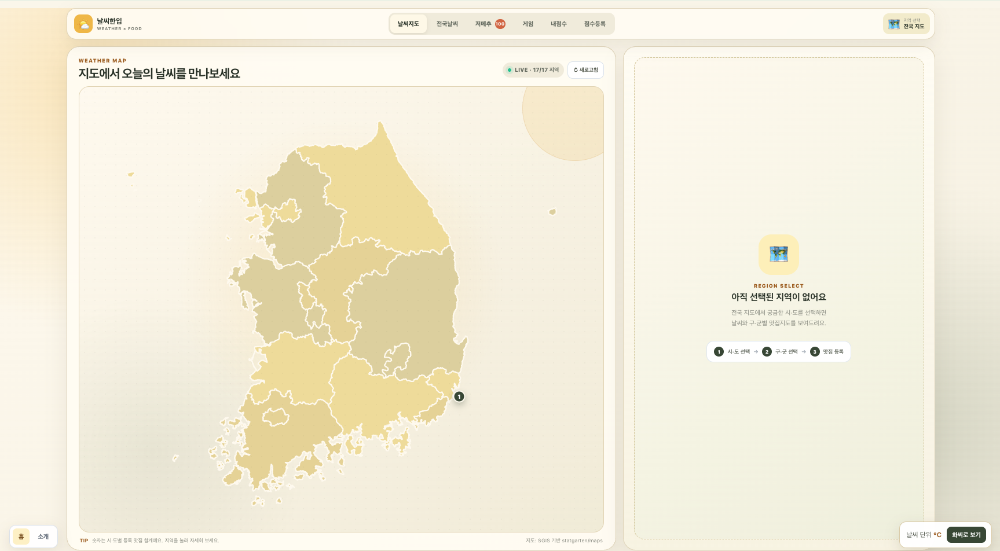
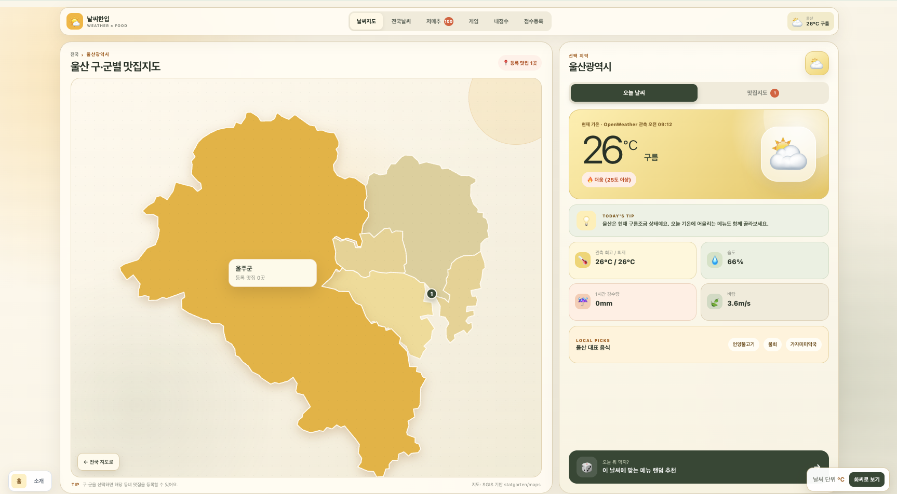
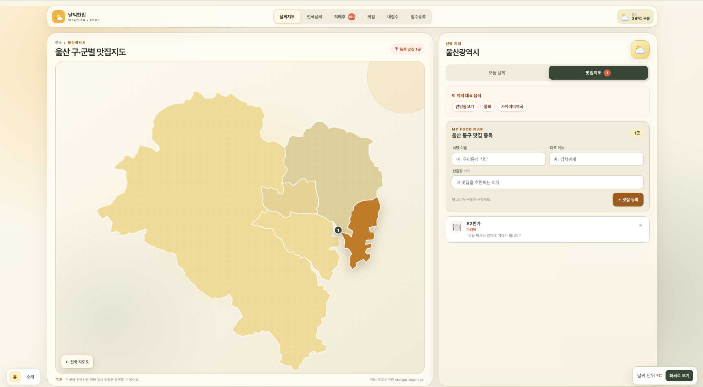
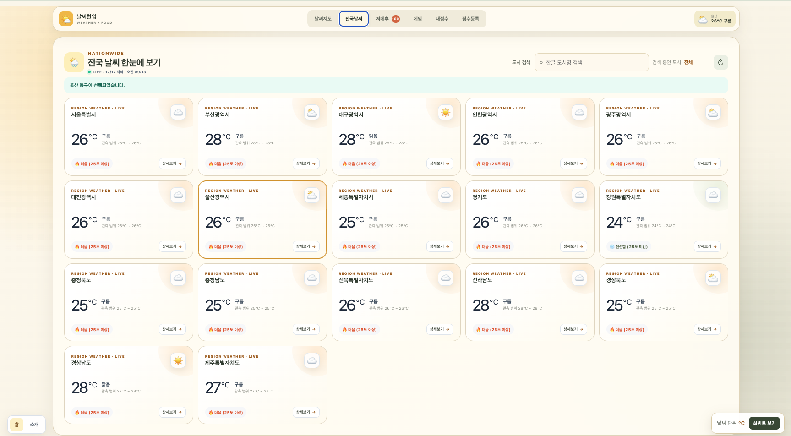
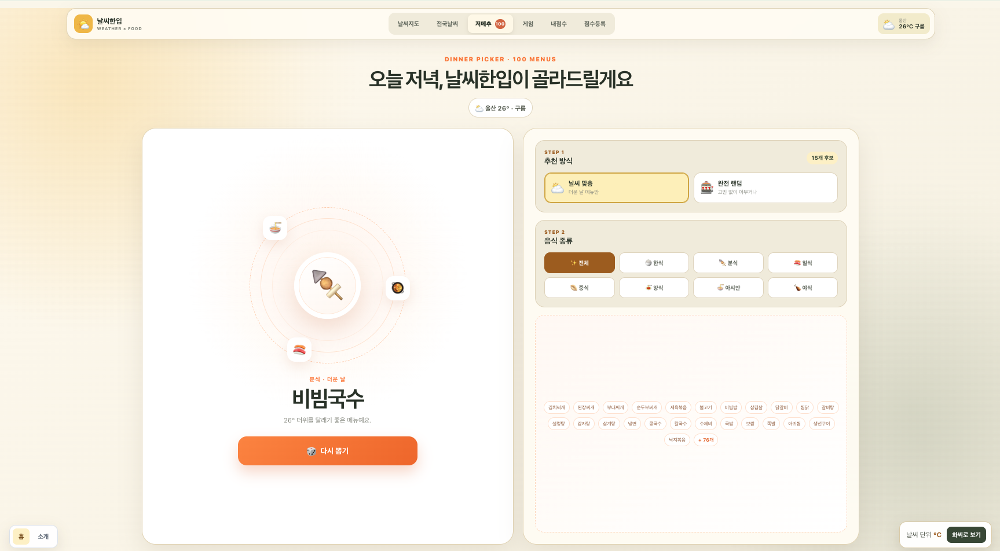
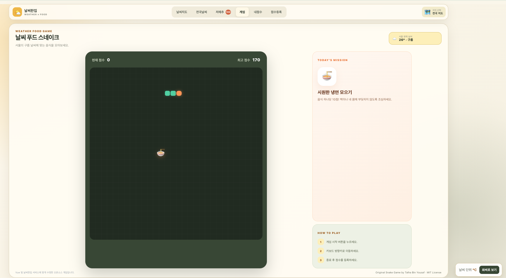
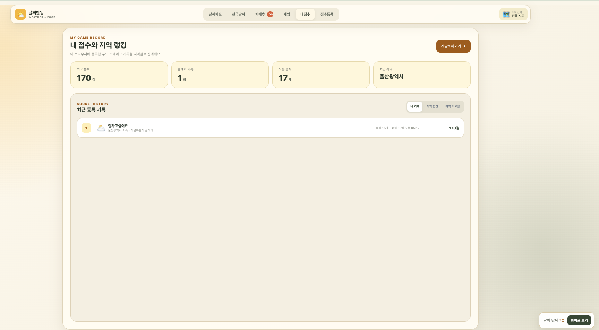

# 🌤️ 날씨한입

전국 17개 시·도의 현재 날씨를 지도와 카드로 확인하고, 날씨에 어울리는 음식까지 추천받는 Vue 기반 웹 서비스입니다.

날씨 정보가 중심이며, 시·도에서 구·군으로 이어지는 지도 탐색, 나만의 맛집 등록, 100가지 저녁 메뉴 추천, 날씨 푸드 스네이크 게임을 한 화면에서 제공합니다. OpenWeather 요청에 실패한 지역은 과제용 Mock 데이터를 유지해 화면을 안정적으로 표시합니다.



<table>
  <tr>
    <td align="center" width="50%">
      
      <br />
      <sub>울산 현재 날씨와 대표 음식</sub>
    </td>
    <td align="center" width="50%">
      
      <br />
      <sub>구·군별 맛집 지도와 맛집 등록</sub>
    </td>
  </tr>
  <tr>
    <td align="center" width="50%">
      
      <br />
      <sub>전국 17개 시·도 날씨 목록</sub>
    </td>
    <td align="center" width="50%">
      
      <br />
      <sub>날씨 기반 저녁 메뉴 추천</sub>
    </td>
  </tr>
  <tr>
    <td align="center" width="50%">
      
      <br />
      <sub>날씨 푸드 스네이크 게임</sub>
    </td>
    <td align="center" width="50%">
      
      <br />
      <sub>내 게임 기록과 지역 랭킹</sub>
    </td>
  </tr>
</table>

## 실행 및 저장소 주소

- GitHub: [wldn-di/skala-vue](https://github.com/wldn-di/skala-vue)
- 로컬 완성형 화면: [http://localhost:3000/](http://localhost:3000/)
- 배포 주소: https://skala-vue-jiwoo.vercel.app/

## 1~5일차 과제 코드 구조

```text
src/
├── components/
│   └── exercise/
│       ├── WeatherMockup.vue         # 1일차: 디렉티브와 Mock 배열 렌더링
│       ├── WeatherComposition.vue    # 2일차: ref, computed, watch, watchEffect
│       ├── WeatherParent.vue         # 3일차: 부모·자식 컴포넌트 조합
│       ├── BaseDashboardCard.vue     # 3일차: slot 공통 카드
│       ├── SearchBar.vue             # 3일차: props / emit 검색창
│       ├── WeatherCard.vue           # 3일차: props / emit 날씨 카드
│       ├── WeatherStatusBar.vue      # 3일차: 선택 상태 표시
│       └── UnitToggler.vue           # 5일차: Pinia 단위 전환
├── stores/
│   └── configStore.js                # 5일차: state / getter / action
└── views/
    ├── WeatherHomeView.vue           # 4일차: Router 완성형 화면
    └── PracticeFiveView.vue          # 5일차: Store 연결 화면
```

## 과제별 실행 URL

개발 서버를 실행한 뒤 아래 주소로 접속합니다. 과제 링크는 완성형 앱의 디자인을 유지하기 위해 화면 메뉴에는 추가하지 않았습니다.

| 단계 | URL | 핵심 구현 | 주요 파일 |
|---|---|---|---|
| 최종 화면 | [`/`](http://localhost:3000/) | 과제 5 완성형 화면 | `PracticeFiveView.vue` |
| 과제 1 | [`/practice1`](http://localhost:3000/practice1) | Mock 배열, `v-for`, `:key`, `v-if`/`v-else` | `WeatherMockup.vue` |
| 과제 2 | [`/practice2`](http://localhost:3000/practice2) | `ref`, `computed`, `watch`, `watchEffect` | `WeatherComposition.vue` |
| 과제 3 | [`/practice3`](http://localhost:3000/practice3) | Components, props, emits, slot, scoped style | `WeatherParent.vue` 및 자식 컴포넌트 |
| 과제 4 | [`/practice4`](http://localhost:3000/practice4) | Router 완성형 화면, 섭씨 고정 | `WeatherHomeView.vue` |
| 과제 5 | [`/practice5`](http://localhost:3000/practice5) | Pinia 섭씨/화씨 단위 전환 | `PracticeFiveView.vue`, `configStore.js` |

Router 검증용 추가 주소는 다음과 같습니다.

- `/about`: 서비스 소개
- `/weather/:cityId`: 지역 상세 날씨. 예: `/weather/seoul`
- 존재하지 않는 주소: Catch-all 404 화면

## 주요 기능

- 전국 17개 시·도의 현재 날씨를 지도와 카드로 표시
- OpenWeather 실시간 관측값과 지역별 Mock 데이터 폴백
- 일부 지역 요청만 실패해도 성공한 지역부터 갱신하는 부분 성공 처리
- 시·도에서 구·군으로 이어지는 SVG 지도 드릴다운
- 구·군별 나만의 맛집 등록과 삭제
- 도시명 검색과 검색 결과 없음 UI
- 날씨·기온·음식 카테고리를 조합한 100가지 저녁 메뉴 추천
- 현재 날씨에 따라 미션 음식이 달라지는 스네이크 게임
- 게임 결과 등록, 개인 기록, 지역 합산·최고점 랭킹
- Pinia 기반 섭씨·화씨 단위 전환
- 동적 상세 경로와 Catch-all 404 페이지
- 데스크톱과 모바일에 대응하는 반응형 레이아웃

## 기술 스택

| 구분 | 사용 기술 |
|---|---|
| Frontend | Vue 3, Composition API, Vite |
| State | Pinia |
| Router | Vue Router |
| HTTP | Fetch API, Axios 실습 |
| UI | CSS, SVG Map, Element Plus 실습 |
| Weather | OpenWeather API |
| Serverless / Deploy | Vercel Functions, Vercel |
| Quality | ESLint, Oxlint, Prettier |

## 화면 구성

| 경로 또는 메뉴 | 역할 |
|---|---|
| `/` · 날씨지도 | 전국 지도에서 시·도를 선택하고 날씨와 구·군별 맛집을 확인 |
| `/` · 전국날씨 | 17개 시·도 날씨 카드 검색 및 상세 화면 이동 |
| `/` · 저메추 | 날씨 맞춤 또는 완전 랜덤 방식으로 저녁 메뉴 추천 |
| `/` · 게임 | 현재 선택 지역의 날씨를 반영한 푸드 스네이크 게임 |
| `/` · 내점수 / 점수등록 | 브라우저에 저장한 플레이 기록과 지역 랭킹 관리 |
| `/weather/:cityId` | 선택한 지역의 기온·날씨 지표 상세 |
| `/about` | 서비스와 과제 구성 소개 |
| `/practice1` ~ `/practice5` | 일차별 과제 결과를 독립적으로 검증 |
| `/:pathMatch(.*)*` | 존재하지 않는 주소의 404 안내 |

라우트 컴포넌트는 함수형 `import()`로 지연 로딩합니다. 완성형 화면 안의 날씨지도·전국날씨·저메추·게임·점수 화면은 `activeView` 상태로 전환합니다.

## 데이터 흐름

### 날씨

1. 완성형 화면이 마운트되면 브라우저가 `/api/weather`를 요청합니다.
2. 로컬에서는 Vite 플러그인, 배포 환경에서는 Vercel Function이 요청을 처리합니다.
3. 서버는 허용된 전국 17개 시·도 좌표만 OpenWeather에 요청하며, `Promise.allSettled()`로 지역별 성공과 실패를 분리합니다.
4. 응답에서 기온·체감 온도·습도·풍속·강수량과 날씨 코드를 화면용 데이터로 정규화합니다.
5. 브라우저는 성공한 지역만 실시간 값으로 병합하고 실패한 지역은 기존 Mock 데이터를 유지합니다.
6. 새로고침 버튼으로 다시 동기화할 수 있으며, 화면을 떠날 때 진행 중인 요청을 취소합니다.

### 지도와 맛집

1. 전국 SVG 지도에서 시·도를 선택하면 해당 지역의 구·군 경계 지도로 전환합니다.
2. 구·군을 선택하면 맛집 등록 패널을 표시합니다.
3. 식당명·대표 메뉴·추천 이유를 입력하면 선택한 지역과 함께 `localStorage`에 저장합니다.
4. 지도 배지와 패널 목록은 저장된 맛집 수를 반응형으로 다시 계산합니다.

### 메뉴 추천

1. 선택한 지역이 없으면 첫 번째 지역, 있으면 현재 선택 지역의 날씨를 사용합니다.
2. 날씨 상태와 기온을 `rainy`, `hot`, `cold`, `mild` 태그로 분류합니다.
3. 날씨 맞춤 또는 완전 랜덤 방식을 선택하고 8개 음식 분류로 후보를 좁힙니다.
4. 100개 Mock 메뉴 중 한 가지를 랜덤으로 뽑아 추천 이유와 함께 표시합니다.

### 게임과 점수

1. 선택 지역의 날씨와 기온에 따라 게임 미션 음식이 달라집니다.
2. 게임 종료 결과에 플레이 지역과 날씨 정보를 결합합니다.
3. 닉네임과 본인 지역을 입력하면 결과를 `localStorage`에 저장합니다.
4. 저장된 기록을 개인 이력, 지역 합산 점수, 지역 최고점 기준으로 집계합니다.

## 캐시 및 저장 정책

| 데이터 | 저장 위치 | 유지 방식 |
|---|---|---|
| OpenWeather 완성 응답 | 서버 메모리 | 10분 캐시 |
| 마지막 정상 날씨 | 서버 메모리 | 전체 요청 실패 시 최대 1시간 이내 응답을 Stale 데이터로 재사용 |
| Vercel 날씨 응답 | CDN | 10분 캐시, 이후 30분 동안 재검증하며 기존 응답 사용 |
| 등록 맛집 | `localStorage` | 사용자가 삭제하기 전까지 현재 브라우저에 유지 |
| 게임 점수와 지역 랭킹 원본 | `localStorage` | 새로고침 후에도 현재 브라우저에 유지 |
| 섭씨·화씨 설정 | Pinia 메모리 | 실행 중 유지, 새로고침 시 섭씨로 초기화 |
| 과제용 지역 날씨 | 소스 코드 Mock 데이터 | API 미설정·실패 지역의 폴백으로 사용 |

## 프로젝트 구조

```text
skala-vue/
├── api/
│   └── weather.js                    # Vercel 날씨 서버리스 함수
├── public/
│   ├── maps/                         # 전국 및 시·도별 SVG 경계 지도
│   └── screenshots/                  # README 화면 이미지
├── server/
│   └── weatherService.js             # OpenWeather 요청·정규화·서버 캐시
├── src/
│   ├── components/
│   │   ├── exercise/                 # 단계별 과제와 완성형 기능 컴포넌트
│   │   │   └── game/                 # 게임, 점수 등록, 기록·랭킹
│   │   └── practices/                # 강의 개념별 실습 컴포넌트
│   ├── router/                       # Vue Router와 지연 로딩 경로
│   ├── stores/                       # Pinia 단위 설정 Store
│   ├── views/                        # 메인, 상세, 소개, 404 페이지
│   ├── App.vue
│   └── main.js
├── vite.config.js                    # Vite 설정과 로컬 날씨 API 플러그인
├── vercel.json                       # 보안 헤더 설정
└── package.json
```

## 과제 3 컴포넌트 구조

```text
WeatherParent.vue
├── BaseDashboardCard.vue  # 검색·목록 공통 디자인과 slot
│   ├── SearchBar.vue      # currentQuery prop / update-query emit
│   └── WeatherCard.vue    # cityItem prop / select-card, click-detail emits
└── WeatherStatusBar.vue   # 개인 Customization 추가 컴포넌트
```

반응형 데이터, 검색 필터, 선택 상태와 상세 처리 함수는 `WeatherParent.vue`가 소유합니다. Slot으로 주입되는 자식 컴포넌트와도 부모가 직접 props/emits로 통신합니다.

## 실행 방법

### 1. 의존성 설치

```sh
npm install
```

Node.js `^20.19.0` 또는 `>=22.12.0` 환경을 사용합니다.

### 2. 환경 변수 설정

`.env.example`을 복사해 프로젝트 루트에 `.env` 파일을 만들고 OpenWeather API 키를 입력합니다.

```sh
cp .env.example .env
```

```dotenv
WEATHER_API_KEY=your_openweather_api_key
```

- `WEATHER_API_KEY`는 로컬 Vite 서버와 Vercel Function에서만 사용합니다.
- 브라우저 번들에 포함되지 않도록 `VITE_` 접두사를 붙이지 않습니다.
- 실제 키가 들어 있는 `.env` 파일은 Git에 커밋하지 않습니다.
- 키가 없거나 요청이 실패해도 완성형 화면은 기존 Mock 데이터를 표시합니다.

### 3. 개발 서버 실행

```sh
npm run dev
```

기본 주소는 [http://localhost:3000/](http://localhost:3000/)입니다. Vite 개발 플러그인이 로컬에서도 `/api/weather` 요청을 처리합니다.

### 4. 프로덕션 빌드

```sh
npm run build
npm run preview
```

## Vercel 배포

Vercel 프로젝트 설정에서 `WEATHER_API_KEY` 환경 변수를 등록합니다.

| 항목 | 값 |
|---|---|
| Build Command | `npm run build` |
| Output Directory | `dist` |
| Serverless Function | `api/weather.js` |
| Environment Variable | `WEATHER_API_KEY` |

환경 변수를 추가하거나 변경한 뒤에는 새 배포를 실행해야 반영됩니다. `vercel.json`은 CSP, Referrer Policy, MIME Sniffing 방지, Frame 차단 등 공통 보안 헤더를 설정합니다.

## 강의 학습 요소

- `v-for`와 `:key`를 이용한 날씨·음식·점수 목록 반복 렌더링
- `v-if` / `v-else-if` / `v-else`를 이용한 선택·검색 결과·빈 상태 분기
- `:value`와 `@input`을 이용한 입력값 전달 및 한글 IME 조합 처리
- `ref`를 이용한 검색어·선택값·로딩·게임 상태 관리
- `computed`를 이용한 날씨 검색, 메뉴 후보, 맛집 수, 랭킹 계산
- `watch`와 `watchEffect`를 이용한 상태 변화 확인
- `props` / `emit`을 이용한 부모·자식 컴포넌트 통신
- `slot`을 이용한 공통 대시보드 카드 재사용
- Vue Router의 동적 경로, 지연 로딩, Catch-all Route
- Pinia의 state / getters / actions와 `storeToRefs`
- Fetch API와 Axios를 이용한 HTTP 요청 및 에러 처리 실습
- `Promise.allSettled()`를 이용한 17개 지역 날씨 부분 성공 처리
- 구조분해, 전개 연산자, 옵셔널 체이닝 등 Modern JavaScript
- Element Plus 컴포넌트 사용 실습

## 제출 전 셀프 코드리뷰

- **단일 책임:** 날씨 요청·정규화·캐시는 서버 서비스로, 지도·검색·메뉴·맛집·게임·점수 UI는 기능별 컴포넌트로 분리했습니다. 메인 View는 상태와 컴포넌트를 연결합니다.
- **반응형 상태:** 검색어·선택 지역·활성 화면·로딩처럼 UI에 반영되는 값은 `ref`로, 필터 목록·추천 날씨·랭킹·집계값은 `computed`로 관리합니다.
- **로딩·에러 처리:** 날씨 요청을 `loading`, `success`, `partial`, `error`로 구분하고, 실패한 지역은 Mock 데이터로 유지합니다. 컴포넌트가 해제되면 진행 중인 요청도 취소합니다.
- **이름 명확성:** `filteredWeatherList`, `selectedWeather`, `syncLiveWeather`, `registerGameScore`처럼 데이터와 동작이 드러나는 이름을 사용했습니다.
- **보안:** API 키를 서버 환경에서만 읽고, 날씨 API는 GET 요청과 서버에 등록된 17개 좌표만 허용합니다.

## 검사

```sh
npm run build
npx eslint .
npx oxlint .
```

`npm run lint`는 ESLint와 Oxlint의 자동 수정 옵션까지 함께 실행합니다.

## 오픈소스 출처 및 라이선스

### 지도 데이터

- 지도 경계 파일: [statgarten/maps](https://github.com/statgarten/maps)
- 원 데이터: SGIS 행정구역 경계 기반
- 사용 방식: 전국 시·도 및 시·도별 구·군 SVG 지도를 날씨·맛집 선택 UI에 연결

### Snake Game

- Original project: [HTML/CSS and JavaScript Games — 24-Snake-Game](https://github.com/he-is-talha/html-css-javascript-games/tree/main/24-Snake-Game)
- Original author: Talha Bin Yousaf
- Changes: Adapted to a Vue component, integrated with weather-based food missions, and connected to local score registration.

```text
MIT License

Copyright (c) 2024 Talha Bin Yousaf

Permission is hereby granted, free of charge, to any person obtaining a copy
of this software and associated documentation files (the "Software"), to deal
in the Software without restriction, including without limitation the rights
to use, copy, modify, merge, publish, distribute, sublicense, and/or sell
copies of the Software, and to permit persons to whom the Software is
furnished to do so, subject to the following conditions:

The above copyright notice and this permission notice shall be included in all
copies or substantial portions of the Software.

THE SOFTWARE IS PROVIDED "AS IS", WITHOUT WARRANTY OF ANY KIND, EXPRESS OR
IMPLIED, INCLUDING BUT NOT LIMITED TO THE WARRANTIES OF MERCHANTABILITY,
FITNESS FOR A PARTICULAR PURPOSE AND NONINFRINGEMENT. IN NO EVENT SHALL THE
AUTHORS OR COPYRIGHT HOLDERS BE LIABLE FOR ANY CLAIM, DAMAGES OR OTHER
LIABILITY, WHETHER IN AN ACTION OF CONTRACT, TORT OR OTHERWISE, ARISING FROM,
OUT OF OR IN CONNECTION WITH THE SOFTWARE OR THE USE OR OTHER DEALINGS IN THE
SOFTWARE.
```
